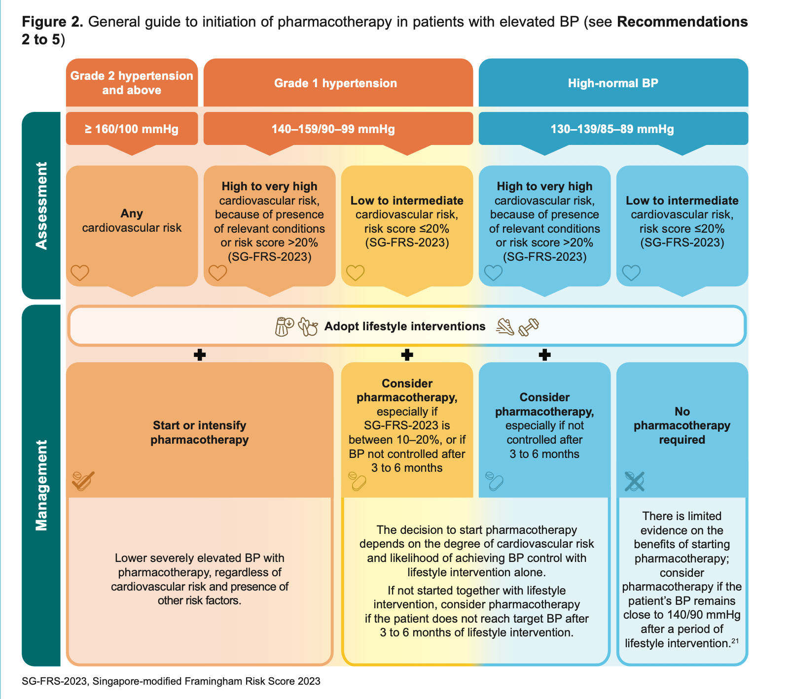
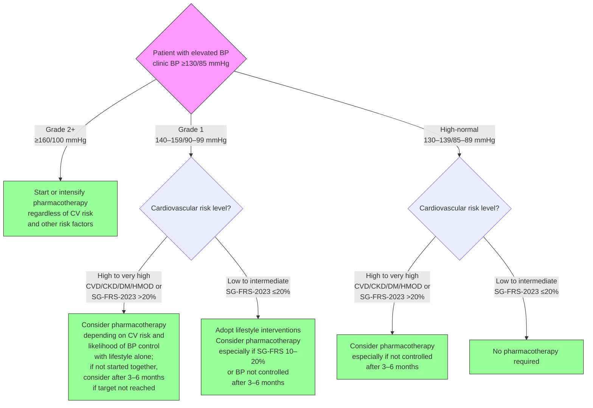
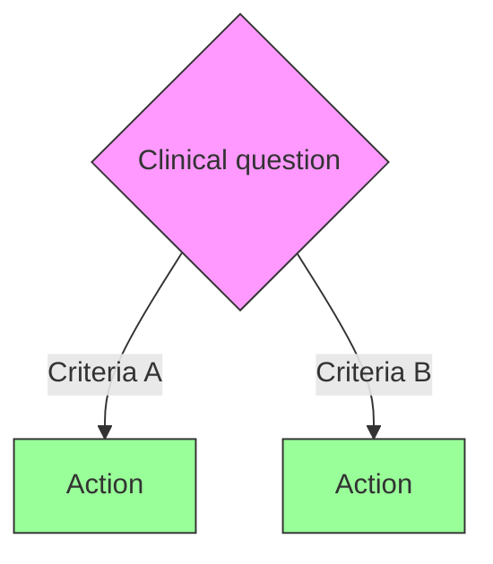

# cpg-pdf2md

Convert clinical practice guideline PDFs into structured, validated markdown using a 6-agent Claude Code pipeline. This is based on https://github.com/maximilienbouchet/cpg-pipeline .

## Before / After

**Source PDF** (page 4 of ACG Hypertension guideline):



**Structured output** — the same clinical logic as a Mermaid decision tree:



Each output file includes YAML frontmatter, cross-references between sections, inline strength annotations (`<!-- STRENGTH: strong -->`), and `<!-- REVIEW -->` flags for anything that needs clinical verification.

## Quick start

```bash
git clone <this-repo>
cd cpg-pipeline

# Drop your guideline PDF in source/
cp ~/Downloads/my-guideline.pdf source/

# Run the pipeline
./scripts/run-pipeline.sh source/my-guideline.pdf

# Output lands in output/<basename>/final/
# Combined output in output/<basename>/combined/<basename>-combined.md
# Review flags in eval/<basename>/reconciliation-summary.md

# Validate the output
python3 scripts/validate.py
```

## Output format

Every output file follows [`templates/cpg-section.schema.md`](templates/cpg-section.schema.md). Three things to know:

**1. YAML frontmatter** on every file:

```yaml
---
cpg_id: "acg-hypertension_15dec2023"
section_id: "lifestyle-intervention"
section_title: "Lifestyle Intervention and Initiation of Pharmacotherapy"
source_pages: [4]
content_types: [prose, decision_tree]
validated: true
validated_date: 2026-04-06
review_flags:
  - "G1_HIGH Mermaid node corrected — verify clinical intent preserved"
---
```

**2. Mermaid `graph TD`** for branching decisions (triage, classification, treatment selection):



**3. IEET (If-Elif-Else Tree)** for sequential treatment logic (step therapy, escalation):

```
If [patient on pharmacotherapy and BP target not reached (~3 months)]:
  If [modifiable factors identified]: Address before intensifying treatment
  Elif [modifiable factors ruled out]:
    Intensify treatment using one of the following options based on clinical context:
    - Increase dosage of current medication
    - Add a different antihypertensive class at low dose
    - Switch to a different medication class
```

Full format rules: [`templates/decision-logic.schema.md`](templates/decision-logic.schema.md).

## Pipeline overview

```
source/*.pdf
    │
    ▼
┌─────────┐   ┌───────────┐   ┌────────────┐   ┌─────────┐   ┌────────────┐   ┌──────────┐
│ 1. SCAN │──▶│ 2. EXTRACT│──▶│ 3.STRUCTURE│──▶│ 4. CHECK│──▶│5. RECONCILE│──▶│ 6.COMBINE│
└─────────┘   └───────────┘   └────────────┘   └─────────┘   └────────────┘   └──────────┘
 manifest      raw text +       schema-         validation    fixes + final     single merged
 (YAML)        visual desc.     compliant md    reports       validated output  markdown doc
                                                │
                                          eval/*.md
```

1. **SCAN** — reads every page with vision, outputs a YAML manifest of sections, page ranges, and content types.
2. **EXTRACT** — pulls raw text and describes every visual element (flowcharts, tables, figures) verbatim. No interpretation.
3. **STRUCTURE** — converts raw extraction into schema-compliant markdown: frontmatter, Mermaid trees, IEET blocks, cross-references.
4. **CHECK** — fresh context, adversarial: compares structured output against the source PDF for completeness, accuracy, schema compliance, and clinical safety.
5. **RECONCILE** — resolves checker findings: fixes schema/accuracy issues, fills completeness gaps, adds `<!-- REVIEW -->` tags for anything requiring clinical judgement.
6. **COMBINE** — merges all reconciled section files into one hierarchically-structured markdown document with a table of contents.

Each agent runs in a separate Claude session with no shared context. The checker has never seen the extraction or structuring work. Agent definitions: [`.claude/skills/`](.claude/skills/).

## Requirements

- [Claude Code](https://docs.anthropic.com/en/docs/claude-code) (the `claude` CLI must be on your PATH)
- Python 3 with `pyyaml` (`pip3 install pyyaml`)
- A Claude plan with sufficient usage for ~6 sessions per guideline

The pipeline shell script calls `claude -p` with `--permission-mode auto` for each agent. Review [`.claude/skills/`](.claude/skills/) to understand what tools each agent is granted.

## Adapting for new guideline types

The pipeline is guideline-agnostic. To handle a new type:

1. **No code changes needed** for standard guidelines. Drop the PDF in `source/` and run.
2. **For non-standard formats** (scanned images, multi-column layouts, non-English), check the scan manifest after Phase 1 for quality flags and adjust expectations.
3. **To change the output schema**, edit the templates in [`templates/`](templates/). All agents reference these as the contract. Changes propagate automatically.
4. **To modify agent behaviour**, edit the relevant SKILL.md in [`.claude/skills/`](.claude/skills/). Each is self-contained.

### Clinical content rules

These are enforced across all agents and are non-negotiable:

- Never invent clinical content. Flag unclear items with `<!-- REVIEW: ... -->`.
- Drug names: generic only (metformin, not Glucophage).
- Units: always explicit (mg/dL, mmol/L, mL/min/1.73 m²).
- Doses: exact match to source — never round.

## License

MIT
