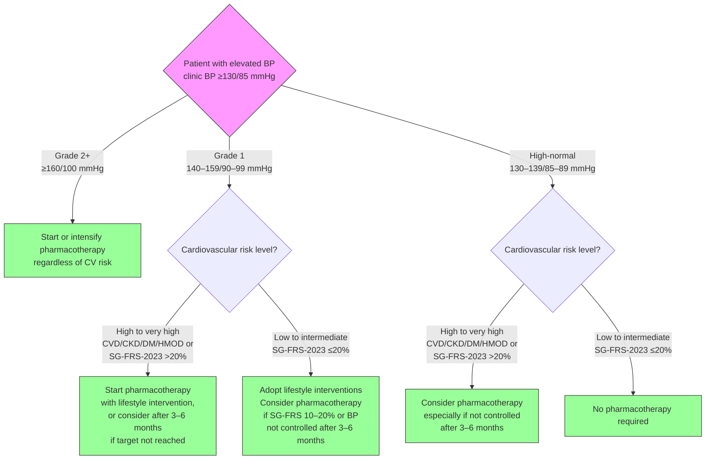

# Lifestyle Intervention and Initiation of Pharmacotherapy

## Benefits of Lifestyle Intervention

For patients with elevated BP, lifestyle intervention includes healthy diet (e.g., reducing sodium intake and alcohol consumption), increased physical activity, weight reduction if overweight or obese, and smoking cessation. Benefits of lifestyle intervention extend across age groups and cardiovascular risk levels, and are therefore encouraged for all patients.

Studies have reported up to 17/10 mmHg BP reduction when lifestyle intervention with two or more components (e.g., healthy diet and active lifestyle) is maintained for at least four months.

A personalised approach taking into consideration factors such as comorbidities, patient's preferences, quality of life, frailty, functionality, and cognitive status will help in setting sustainable lifestyle plans.

For patients with concomitant CKD, see ACG on CKD management, as advice relating to salt and protein intake can vary.

## When to Initiate Pharmacotherapy

Pharmacotherapy complements lifestyle intervention where appropriate. The decision to initiate treatment with antihypertensive medications is guided by the patient's BP, cardiovascular risk, and presence of conditions such as CVD, CKD, DM, or HMOD.

### Figure 2: General guide to initiation of pharmacotherapy in patients with elevated BP

See [Recommendations 2 to 5](./pharmacotherapy-selection.md) for pharmacotherapy details.

**Note on high-normal BP:** There is limited evidence on the benefits of starting pharmacotherapy for patients with high-normal BP; consider pharmacotherapy if the patient's BP remains close to 140/90 mmHg after a period of lifestyle intervention.
