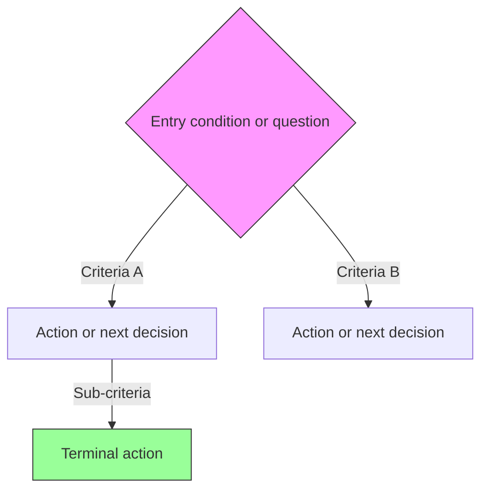

# Decision Logic Schema

Two formats for clinical decision logic. Use the right one for the right job.

## Format 1: Mermaid (for branching/routing decisions)

Use when: patient classification, triage, diagnostic algorithms,
treatment selection with multiple independent branches.

Template:

Rules:
- Entry nodes: diamond {curly braces} with clinical question
- Decision nodes: diamond {curly braces} with criteria
- Action nodes: square [brackets] with clinical action
- Terminal/leaf nodes: green styling
- Edge labels: the criteria that routes to that branch
- EVERY path must reach a terminal node (no dead ends)
- Maximum 3 levels deep per diagram. Split into linked diagrams if deeper.

## Format 2: IEET (for sequential treatment escalation)

Use when: step therapy, titration protocols, escalation ladders,
time-sequenced management.

Template:
If [primary condition]:
  Start [first-line intervention] at [dose/frequency]
  Monitor [parameter] at [interval]
  If [target met]: Continue, review at [interval]
  Elif [target not met] AND [secondary condition]:
    Escalate to [second-line intervention]
    If [contraindication]: Use [alternative] instead
  Elif [target not met] AND [no secondary condition]:
    Add [adjunct therapy]
  Else:
    Refer to [specialist] <!-- REVIEW: check referral criteria -->

Rules:
- Natural language, indented by 2 spaces per level
- Explicit conditions at every branch (no implicit "otherwise")
- Include doses, frequencies, and monitoring intervals
- Maximum 4 levels of nesting. If deeper, split into linked blocks.
- Flag any ambiguity with <!-- REVIEW: ... -->
